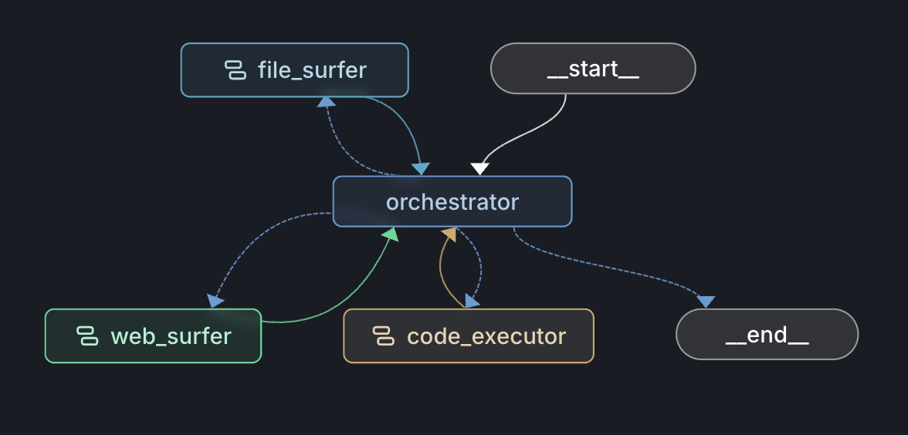
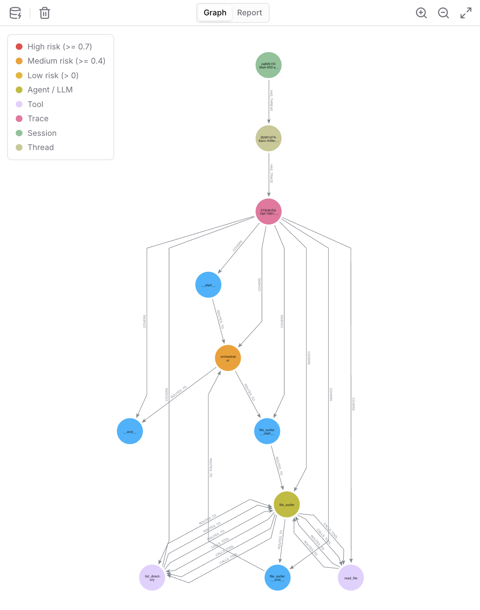

# API - Anomaly Backend

This is the backend for an anomaly detection system built around a single graph representation of multi-agent execution. It's heavily inspired by the [SentinelAgent paper](./2505.24201v1.pdf) and my own [research notes](../README.md) on what makes multi-agent systems hard to monitor.

The core idea is, instead of treating agent runs as flat logs or JSON blobs, we model them as a dynamic execution graph where agents and tools are nodes, and their interactions (tool calls, routing decisions, message passing) are edges. This lets us reason about failures at multiple levels—individual nodes, risky edges, and multi-step attack paths.

This is a nuanced problem space. Good anomaly detection needs quality data and coverage. What I've built here is a starting point—a proof-of-concept that shows the graph approach works, but it'll need tuning, better attack path libraries, and more baseline data to be production-ready.

I chose to use [LangGraph](https://langchain-ai.github.io/langgraph/) to build the following agent architecture. [LangSmith](https://smith.langchain.com/) is used to store traces of the agent's execution. [NetworkX](https://networkx.org/) for in-memory graphs and [Neo4j](https://neo4j.com/) for persistent graph storage. [Redis](https://redis.io/) is used for payload storage (keeps Neo4j lean). [PostgreSQL](https://www.postgresql.org/) is used for sentinel reports and metadata.





## Flow

1. Run — Client calls invokes the LangGraph agent to get completions, the agent emits traces to LangSmith.
2. Ingest — We wait for run count to stabilize, fetch runs for the thread, build Turns (one per trace), then build a NetworkX graph and persist to Neo4j and Redis.
3. Sentinel — We run Sentinel on the same turns, it produces an analysis report and we persist it (file, Postgres) and write risk metadata back to Neo4j. Details in [this section](#sentinel).


---

## Why graphs beat the alternatives

Most agent observability tools treat execution as a flat list of events or a tree of spans. That's fine for debugging individual runs, but it doesn't scale when you're trying to detect systemic issues—things that emerge from how agents coordinate, not from what any single agent does.

### What else could we use?

- Flat logs: Standard logs (JSON lines, text dumps) are good for debugging specific errors but terrible for understanding relationships. You can't easily answer "which agents talked to each other?" or "did this tool misuse happen because of a compromised upstream agent?" Logs don't preserve causality or control flow in a queryable way.

- Span trees: Better than logs because they show parent-child relationships, but they're still hierarchical and execution-order-focused. Span trees don't naturally support sideways relationships (agent A influences agent B without a parent-child link), and they don't let you query for patterns like "find all paths where a retrieval tool feeds into code execution."

- Database tables (relational): You could normalize runs into tables (`agents`, `tools`, `invocations`, `messages`), and you'd get SQL queries, which is powerful. But relational schemas are rigid—adding a new relationship type (e.g. "agent X shares memory with agent Y") means schema migrations. More importantly, path queries are painful in SQL. "Find all 3-hop paths from file_surfer → orchestrator → code_executor" becomes recursive CTEs and slow joins.

### Why graphs are better

Graphs are the natural representation for multi-agent systems because:

1. Entities and relationships are first-class: Nodes (agents, tools) and edges (calls, routing, messages) are both queryable. You can ask "show me all edges with `cross_boundary=true`" or "which nodes have `risk_score > 0.8`" with the same ease.

2. Path queries are native: Graph databases are built for traversals. "Find all attack paths matching file_surfer → * → code_executor" is a straightforward pattern match.

3. Flexible schema: Literature talks about static graphs (design-time topology: which agents *can* talk to which tools) and dynamic graphs (runtime: what actually happened). In this implementation, we build the dynamic graph from LangSmith traces, but the structure naturally supports both.

4. Multi-resolution reasoning: You can zoom in (node-level: did this LLM hallucinate a tool call?), zoom out (edge-level: is this routing decision risky?), or look at the whole execution (path-level: does this sequence match a known attack?). The graph unifies all three views.

5. Temporal + structural: Graphs can encode both "who called whom" (structure) and "when" (temporal ordering via edge attributes). That's critical for detecting things like "prompt injection at turn 2 → unsafe code execution at turn 5."

### What we actually store

The graph hierarchy is:

```
Session (user session)
  └─ Thread (conversation/task)
      └─ Trace (one turn, one LangSmith root span)
          └─ Agent/Tool nodes + ROUTES_TO / CALLS_TOOL edges
```

- Nodes have `type` (llm, tool, chain), `name` (orchestrator, file_surfer, etc.), `total_tokens`, `total_cost`, `status`, and Sentinel writes `node_risk_score`, `node_risk_label`, `node_anomaly_types`.
- Edges have `type` (routing, tool_call), `source_trust`, `target_privilege`, `cross_boundary`, `inputs_hash`, `outputs_hash`, and Sentinel writes `edge_risk_score`, `edge_risk_label`, `edge_flow_flags`.
- Redis stores the full `inputs` and `outputs` JSON (run payloads) keyed by `run_id`, so Neo4j stays lean. When Sentinel needs to inspect edge content (e.g. for prompt injection checks), it fetches from Redis via `PayloadStore`.

Check out the full schema [here](./src/graph/schemas.py).

## Things to note 

Delegation chain resolution: In nested agent workflows (e.g. orchestrator calls a sub-agent that has its own internal chain), we walk `parent_run_id` upward to find the owning agent-subgraph chain. This groups runs correctly even when LangSmith's parent-child structure is deep. See `loaders.py:resolve_delegation_chain_id`.

Node vs edge status: Literature emphasizes distinction between nodes and edges. Some anomalies are inherent to an entity (a single agent hallucinating), others are relational (two valid-looking agents having a risky interaction). We model both separately so we can localize failures precisely and apply different remediation (reset the agent vs filter the edge).

---

## Sentinel

### How Sentinel fits together

Entry point is `run_sentinel`, which loads config, builds Guardian/LlamaFirewall clients, runs `BehaviorAnalyzer.analyze_thread(turns)`. The [inference.py](./src/graph/inference.py) module supplies node keys and cross_boundary. Resource baselines run after analysis (Neo4j queries for historical token/cost stats) only after at least 3 samples are available.

### [Config](./config.yaml)

- guardian — [IBM Granite Guardian 3.3](https://www.ibm.com/granite/docs/models/guardian/) via [Ollama](https://ollama.com/): model, base URL, confidence threshold. Used for jailbreak and function-calling hallucination checks.
- firewall — [LlamaFirewall](https://github.com/meta-llama/PurpleLlama/tree/main/Llamafirewall): prompt_guard (prompt injection) and alignment_check (agent alignment). Can be toggled per sub-component.
- graph — e.g. `include_chain_runs` for whether to persist Chain nodes.
- resource_baselines — Enable/disable, z_threshold, min_samples for baseline comparison in Neo4j.
- agent_hints — Pairs of (keyword, name) to infer agent names from system prompts (e.g. "Orchestrator" → `orchestrator`).
- sub_agents — List of sub-agent names (e.g. file_surfer, web_surfer, code_executor) used in inference and attack paths.

### Components

→ [Guardian](./src/graph/guardian.py)  
   - Jailbreak: user-facing content at the orchestrator is checked for prompt injection / jailbreak.  
   - Function-calling hallucination: each tool call from an LLM node is checked for hallucinated or unsafe invocations; optional context (recent messages) is passed.  
   
   Results are yes/no plus confidence, configurable confidence threshold.

→ [LlamaFirewall](./src/graph/llamafirewall_client.py)  
   - [PromptGuard](https://huggingface.co/meta-llama/Llama-Prompt-Guard-2-86M): scans edge content (e.g. user or assistant text) for prompt injection.  
   - [AlignmentCheck](https://www.together.ai/models/llama-4-maverick): given user query, conversation history, and suspicious assistant content, checks alignment with the intended task. Used on edges (routing and tool-call content). Decisions: `ALLOW`, `BLOCK`, `HUMAN_IN_THE_LOOP_REQUIRED`, `SKIPPED`, `ERROR`.

→ [Behavior analyzer](./src/graph/behavior_analyzer.py)  
   - Nodes: For LLM nodes, runs Guardian (jailbreak on orchestrator, hallucination on tool calls). For tool nodes, evaluates `cross_boundary` (low-trust source → high-privilege target).  
   - Edges: Infers edges from the turn (routing + tool calls), extracts edge content (with optional Redis payload store), runs LlamaFirewall (prompt injection; alignment on routing edges). Combines cross_boundary and firewall result into a single edge status.  
   - Attack paths: Extracts the execution path sequence from the turn and runs `match_attack_paths` against a library (e.g. Magentic-One style paths: file_surfer → orchestrator → code_executor).  
   - Tiers: 0 = clean, 1 = global anomaly, 2 = node/edge anomaly, 3 = attack path matched. Report includes per-turn node_statuses, edge_statuses, path_matches, tier, plus a thread-level summary and recommendations.
   - Strict threshold mechanism: When an attack path is detected, Sentinel re-runs node/edge checks with a stricter threshold (lower confidence requirement) to catch anomalies that might have been borderline on the first pass.

→ [Attack path library](./src/graph/attack_paths.py)  
   Defines `AttackPath` (name, sequence of node keys, description, risk_tier, risk_category). We match contiguous subsequences of the observed path against these; any match raises the turn to tier 3 and is listed in path_matches. 
   
   Right now it's hand-coded (Magentic-One patterns from the paper). But the real value comes from evolving this over time—adding new paths when Sentinel (or humans) find novel attack chains, and potentially using an LLM to generate candidate paths from system specs and past incidents.

→ [Resource baselines](./src/graph/resource_baselines.py)  
   If Neo4j and resource_baselines are enabled for each Agent/Tool node in the thread, we compute historical mean/std (excluding this thread) for `total_tokens` and `total_cost`. If current value exceeds `z_threshold` (e.g. 2.5) and we have at least `min_samples` historical nodes, we record a resource anomaly.

→ [Persistence of sentinel results](./src/graph/persistence.py)  
   After saving the report to disk and Postgres, we write back into Neo4j for each node key we set `node_risk_score`, `node_risk_label`, `node_anomaly_types`, `node_last_scanned_at` on matching Agent/Tool nodes.For each (src_key, tgt_key) we set `edge_risk_score`, `edge_risk_label`, `edge_flow_flags`, `edge_last_scanned_at` on ROUTES_TO and CALLS_TOOL edges. So the same graph that stores structure and metrics also stores risk metadata. Check out what a sample report looks like [here](./assets/sample_report.json).

